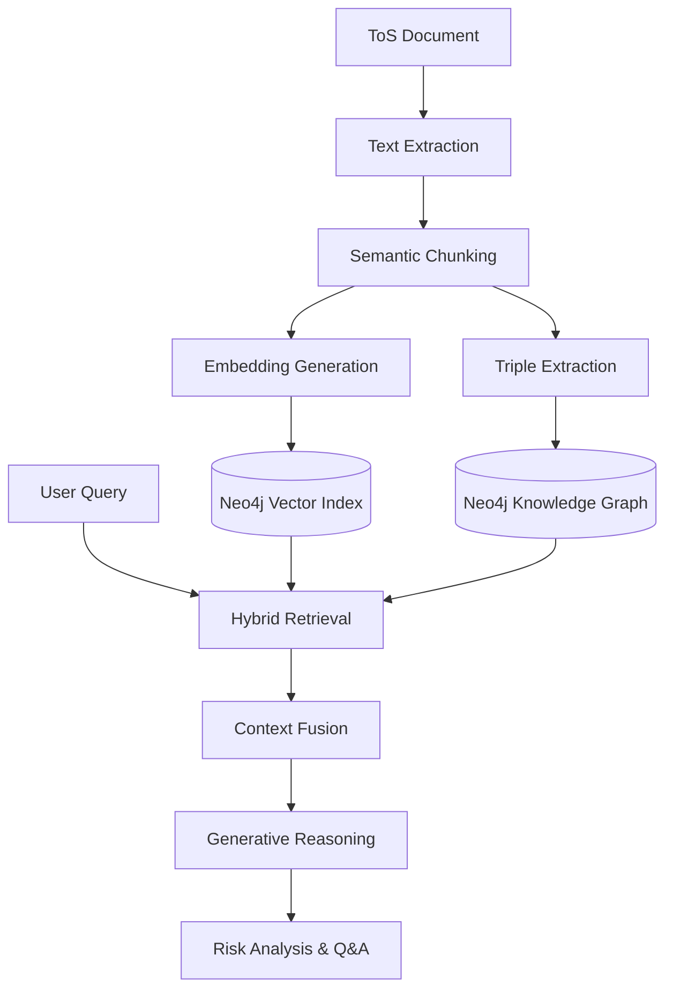
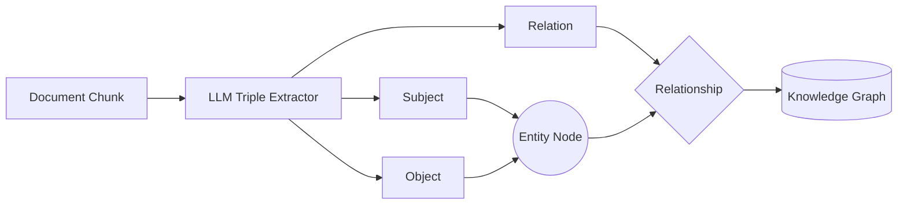

# Knowledge-Graph Assisted Retrieval Augmented Generation Framework for Analysis and Assessment of Terms of Service Documents
### Project: RiskWise

**Student Details:** Ansul Kumar (2262034), Mohammed Amaan Thayyil (2262111)  
**Guided by:** Dr. Janani V S  
**Department:** AI and Data Science Engineering  
**Institution:** School of Engineering and Technology, CHRIST (Deemed to be University)

---

## Agenda

* Abstract
* Problem Statement and Objectives
* Literature Review / Background Study
* Design & Methodology
* Hardware and Software Requirements
* Implementation
* Results & Discussion
* Project Cost Estimation
* SDG Goal Compliance
* Further Steps
* Conclusion
* References

---

## Abstract

* **The Problem**: Digital services rely on lengthy, complex Terms of Service (ToS) that users rarely read, leading to uninformed consent.
* **The Solution**: RiskWise introduces a web-based intelligent system that automatically analyzes ToS documents to identify and explain potentially risky clauses.
* **Core Technology**: A hybrid model combining **Natural Language Processing (NLP)**, **Knowledge Graph (KG)** generation, and **Retrieval-Augmented Generation (RAG)**.
* **Methodology**: Documents are semantically parsed, embedded for vector search, and structured into a Knowledge Graph of contractual obligations.
* **Retrieval Strategy**: Employs a **Hybrid Retrieval** framework (Vector Similarity + Graph Traversal) to extract enriched contextual evidence.
* **Outcome**: A functional prototype providing severity-graded risk analysis and interactive user exploration via conversational Q&A.

---

## Problem Statement and Objectives

### Problem Statement

Traditional Terms of Service agreements are designed for legal protection rather than user comprehension. Most users suffer from "consent fatigue," accepting broad liability waivers, privacy violations, and unilateral modifications without awareness. Existing automated tools often rely on flat text classification, failing to capture the complex, interconnected nature of legal obligations.

### Objectives

* To design a **Hybrid Retrieval** system combining vector similarity and knowledge graph reasoning for legal text.
* To automate the extraction of **structured knowledge triples** (Subject-Predicate-Object) from unstructured ToS documents.
* To implement a **Risk Assessment** module that identifies and classifies clauses based on severity (1-10).
* To provide **Explainable AI (XAI)** summaries that translate legal jargon into user-friendly insights.
* To develop an **Interactive Web Interface** allowing users to query specific contractual concerns.

---

## Literature Review/ Background Study

| S.No. | Author(s) | Paper Title | Core Methodologies | Gaps Identified | Improvement Planned |
|:---:|:---|:---|:---|:---|:---|
| 1. | M. Lippi, G. Paolacci, and P. Torroni | CLAUDETTE: An automated detector of potentially unfair clauses in online terms of service | **ML-based Classification:** Introduced automated identification of unfair ToS clauses using ML and deep learning techniques. | **Structural Blindness:** Focused on independent clause classification; lacked reasoning on complex contract structures or inter-clause dependencies. | **Hybrid Reasoning:** RiskWise moves beyond classification by integrating Knowledge Graphs to capture structural logic and inter-clause relationships. |
| 2. | H. de Martim | An Ontology-Driven Graph RAG for Legal Norms: A Structural, Temporal, and Deterministic Approach | **Legislative Modeling:** Proposes a graph RAG modeling hierarchical and temporal structures of legislation using "Work" vs "Expression" nodes. | **Scope Limitation:** Focuses on public law and temporal evolution; does not address adversarial private contracts or "unfair clause" detection. | **Domain Adaptation:** Adapts the structural graph approach to private law, focusing on normative logic and unfairness detection in static text. |
| 3. | N. P. P. Juttu, S. Singireddy, S. Gona, and S. Timilsina | Text to Trust: Evaluating Fine-Tuning and LoRA Trade-offs in Language Models for Unfair Terms of Service Detection | **Model Benchmarking:** Systematic benchmark of LLMs (BERT, Llama, SaulLM) for classifying clauses as "fair" or "unfair" using CLAUDETTE. | **Lack of Explainability:** Focuses on binary classification without explanation; analyzes clauses in isolation, missing cross-referential risks. | **RAG Integration:** Moves to reasoning by using KG context to generate natural language explanations of risks, bridging detection and user understanding. |
| 4. | Shuang Liu, Zelong Li, Ruoyun Ma, Haiyan Zhao, Mengnan Du | ContractEval: A Benchmark for Evaluating LLMs on Contract Review | **Extraction Benchmarking:** Benchmarks open-source vs proprietary LLMs on clause extraction; finds open-source models suffer from "laziness." | **Retrieval Failure:** Large context windows fail to capture complex dependencies; poor recall ("laziness") without structured retrieval. | **Structural Forcing:** Uses KG traversal to mechanically surface hidden clauses, forcing the retrieval of connected nodes even if LLM is "lazy." |
| 5. | A. Jha, A. Salinas, and F. Morstatter | Knowledge Graph Analysis of Legal Understanding and Violations in LLMs | **Logic Validation:** Utilizes Knowledge Graphs to analyze LLM violations of legal logic and fact consistency in contract understanding. | **Practical Gap:** Primarily an analytical study of LLM reasoning behavior; lacks a practical, interactive framework for end-user risk assessment. | **User-Centric Framework:** Implements a full-stack system applying logical validation concepts to assist non-experts via interactive conversational Q&A. |

---

## Design & Methodology

The system follows a multi-stage pipeline to transform raw legal text into actionable risk insights.

### System Architecture

### Knowledge Graph Generation Details

---

## Hardware and Software Requirements

### Hardware
* **Processor**: Multi-core CPU (Intel i5/i7 or equivalent).
* **RAM**: 16 GB minimum.
* **Storage**: SSD for fast indexing and retrieval.
* **GPU**: Recommended for local LLM inference (Ollama).

### Software
* **Backend**: FastAPI (Python).
* **Frontend**: ReactJS (Vite, TailwindCSS).
* **Database**: Neo4j (Vector & Graph Storage).
* **AI Orchestration**: LangChain.
* **NLP**: spaCy (Semantic Chunking).
* **LLMs**: Mistral 7B (Local/Ollama) or Groq API (Cloud).

---

## Implementation

### The Ingestion Pipeline
1.  **Semantic Chunking**: Using `spaCy` to preserve clause boundaries rather than fixed-length windows.
2.  **Vectorization**: `SentenceTransformers` map chunks into a high-dimensional vector space.
3.  **Triple Extraction**: LLM-guided extraction of Subject-Relation-Object triples.
    *   *Example*: `(Company, may_terminate, account)`
4.  **Graph Construction**: Triples are merged into Neo4j with `MENTIONED_IN` links to text chunks.

### Implementation Detail (Backend)
*   `ingest.py`: Manages the parallel execution of triple extraction and Neo4j storage.
*   `retrieve.py`: Implements the `generate_rag_response` function that fuses vector search results with KG triples to ground the LLM's response.

---

## Results & Discussion

### Contextual Retrieval Performance
*   **Hybrid Search**: Combining vector similarity with graph traversal achieved greater contextual completeness than purely semantic retrieval.
*   **Interactive Q&A**: Users can perform follow-up queries grounded in retrieved document context.

### Risk Detection Accuracy
The system successfully flagged **High-Risk** clauses across key categories:
*   **Unilateral Modifications**: Rights to modify terms without user notice.
*   **Liability Limitations**: Broad disclaimers for service interruptions or data loss.
*   **Data Usage**: Permissions for third-party data sharing.
*   **Termination**: Suspension of accounts without cause.

---

## Project Cost Estimation

### Project Execution Cost
| No | Category | Description | Estimated Cost (₹) |
|:---:|:---|:---|:---:|
| 1 | Software Tools | Open-source frameworks (FastAPI, React, Neo4j) | 0 |
| 2 | Hardware | Personal computing resources | 0 |
| 3 | Cloud Usage | Groq API / Hosting (Testing phase) | 2000 |
| 4 | Miscellaneous | Internet and testing | 1000 |
| **Total** | | | **3000** |

### Service Deployment Cost (Hypothetical Monthly)
*   **Cloud Hosting**: ₹1500
*   **Model Inference API**: ₹3000
*   **Database Hosting**: ₹1000
*   **Total Monthly**: **₹5500**

---

## SDG Goal Compliance

The RiskWise project aligns with the United Nations Sustainable Development Goals:

*   **SDG 9: Industry, Innovation, and Infrastructure**
    *   Developing innovative AI-driven infrastructure for automated document analysis and legal tech.
*   **SDG 16: Peace, Justice, and Strong Institutions**
    *   Promoting transparency and fairness in contractual relationships.
    *   Enhancing public access to understandable legal information and promoting informed consent.

---

## Further Steps

*   **Multilingual Support**: Extending the pipeline to analyze ToS in non-English languages using agnostic LLMs.
*   **OCR Integration**: Enabling analysis of scanned or image-based legal documents.
*   **Browser Extension**: Real-time analysis of agreements during online interactions.
*   **Visualizations**: Interactive 3D visualization of the Knowledge Graph for legal auditing and compliance.

---

## Conclusion

*   RiskWise demonstrates the feasibility of **Hybrid Graph-RAG** for specialized legal document analysis.
*   The integration of Knowledge Graphs significantly enhances the **contextual completeness** and **traceability** of AI responses.
*   By translating complex legal jargon into structured, explainable risks, the system empowers users to make **informed decisions** in the digital landscape.
*   The modular architecture ensures scalability and future-proofing against evolving AI models.

---

## References

[1] M. Lippi, G. Paolacci, and P. Torroni, “CLAUDETTE: an automated detector of potentially unfair clauses in online terms of service,” *Artificial Intelligence and Law*, vol. 27, no. 2, pp. 117–139, 2019.

[2] H. de Martim, “An Ontology-Driven Graph RAG for Legal Norms: A Structural, Temporal, and Deterministic Approach,” *arXiv preprint arXiv:2505.00039*, 2025.

[3] N. P. P. Juttu, S. Singireddy, S. Gona, and S. Timilsina, “Text to Trust: Evaluating Fine-Tuning and LoRA Trade-offs in Language Models for Unfair Terms of Service Detection,” *arXiv preprint arXiv:2510.22531*, 2025.

[4] Z. Wang et al., “ContractEval: A Benchmark for Evaluating LLMs on Contract Review,” *arXiv preprint arXiv:2508.03080*, 2025.

[5] A. Jha, A. Salinas, and F. Morstatter, “Knowledge Graph Analysis of Legal Understanding and Violations in LLMs,” *arXiv preprint arXiv:2511.08593*, 2025.

[6] Neo4j Inc., *Neo4j Graph Database Documentation*, 2024.

[7] LangChain, *LangChain Documentation*, 2024.

[8] FastAPI, *FastAPI Framework Documentation*, 2024.

[9] ReactJS, *React Documentation*, 2024.

[10] S. Russell and P. Norvig, *Artificial Intelligence: A Modern Approach*, Pearson, 2020.
